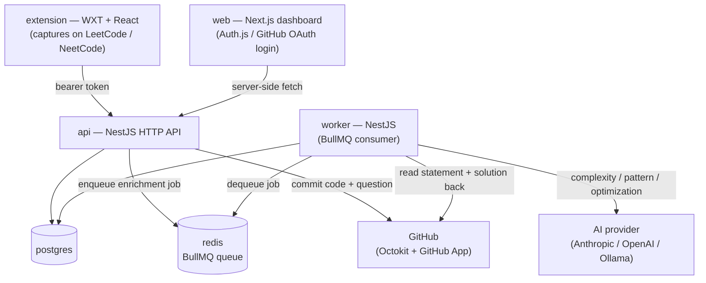

# ShekseCodeSync

Capture every DSA problem you solve on LeetCode / NeetCode, version-control the question and solution in GitHub, enrich it with AI, and turn your history into a searchable dashboard and a smart revision engine.

## Status

Monorepo scaffolded and green in CI; first MVP read-path slice done. See the docs:

- [Product Requirements](docs/PRD.md)
- [Tech Stack](docs/TECH_STACK.md)
- [Decision Log](docs/DECISIONS.md)
- [Design Direction](docs/DESIGN.md)
- [Feature Ideas (v2+ candidates)](docs/FEATURE_IDEAS.md) — draft brainstorm for review

## Where we are / what's next (source of truth = GitHub issues)

Work is tracked as GitHub issues; **open issues are the backlog, closed issues are done**.

```bash
gh-axi issue list --state open      # what's next
gh-axi issue list --state closed    # what's done
```

Done so far: PRD + tech stack signed off, monorepo scaffolded (apps + shared packages, Docker, CI), read-path MVP slice (list submissions), capture write-path MVP slice (commit each problem to the user's GitHub repo on capture, GitHub as source of truth), AI-analysis slice (worker reads the statement + solution back from GitHub and writes complexity/pattern/optimization notes), web dashboard rebuilt in the locked axi.md design, Problems screen (filterable/sortable/paginated submissions grid with per-row GitHub sync status and a read-only code viewer), manual "Add problem" entry point, SRS revision engine (SM-2 scheduler, `POST /revisions` rating + `GET /revisions/queue`, Overview rail wired to real due dates), dedicated Revision screen (`GET /revisions/full-queue`, due-now/soon/upcoming segments, remove-from-queue action), dedicated Insights screen (`GET /insights?year=`, full-year calendar heatmap with click-through, difficulty mix, pattern coverage, streaks, rule-based AI observations). Next up (open issues): LLM-generated AI insights (#51), NeetCode capture adapter, live end-to-end tests.

The working conventions (issue-driven flow, lavish for planning/design, no-mistakes gate for feature work, chrome-devtools-axi for UI verification) live in [`CLAUDE.md`](CLAUDE.md), which a fresh Claude Code session loads automatically.

## The five pillars

**Capture** (browser plugin) → **Store** (GitHub content + DB index) → **Analyze** (AI complexity, pattern, optimization) → **Revise** (question banks & quizzes) → **Visualize** (dashboard & insights).

## Architecture



The API returns as soon as the GitHub commit + DB write succeed; AI enrichment runs async on the worker so capture never waits on a model call. See [`docs/TECH_STACK.md`](docs/TECH_STACK.md) for the full rationale and [`docs/PRD.md`](docs/PRD.md) for the data model.

## Getting started (local dev)

Prerequisites: Node 20+, [pnpm](https://pnpm.io) (via `corepack enable pnpm`), Docker.

```bash
git clone https://github.com/seemantshekhar43/shekse-code-sync.git
cd shekse-code-sync
pnpm install
cp .env.example .env               # fill in GitHub OAuth/App creds + an AI provider key
docker compose up -d postgres redis
pnpm db:migrate                    # apply Prisma migrations
pnpm dev                           # runs web, api, worker together via Turborepo
```

- Dashboard: http://localhost:3000
- API: http://localhost:3001
- Extension: `pnpm --filter @scs/extension dev`, then load the unpacked build in your browser

`.env.example` documents every variable, including how to register the GitHub OAuth App and GitHub App the login and repo-write flows need. `pnpm test`, `pnpm typecheck`, and `pnpm lint` run across the whole workspace; see [`CLAUDE.md`](CLAUDE.md) for the full local runbook (Chrome-driven UI verification, the `no-mistakes` validation gate, etc.) if you're contributing.

## Stack

TypeScript monorepo (pnpm + Turborepo): WXT extension, NestJS API + worker, Next.js dashboard, Postgres + Prisma, BullMQ + Redis, Claude Opus 4.8 via a provider-agnostic Vercel AI SDK layer, Auth.js + GitHub App, all in one `docker-compose.yml`. Self-hosted.
