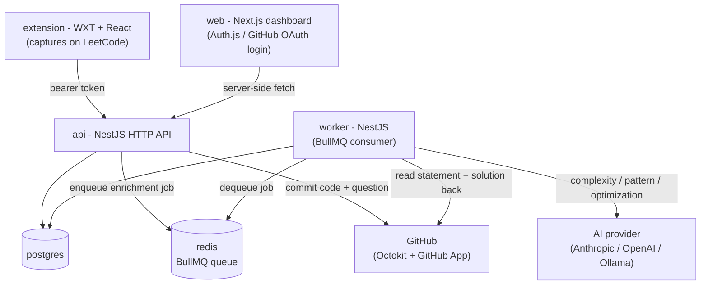

# ShekseCodeSync

[](https://github.com/seemantshekhar43/shekse-code-sync/actions/workflows/ci.yml)
[](LICENSE)
[](CONTRIBUTING.md)

Every DSA problem you solve on LeetCode, automatically version-controlled in your own GitHub repo, enriched with AI analysis, and turned into a searchable dashboard with a spaced-repetition revision engine.

## The problem this solves

If you practice data structures & algorithms regularly (interview prep, competitive programming, or just for fun), your solved problems end up scattered and disposable:

- LeetCode submission history has no lasting home you control - it's locked into the platform's UI.
- There's no record of *how* you solved something (approach, complexity, pattern used) beyond the code itself, so revisiting an old problem means re-deriving everything from scratch.
- Nothing resurfaces problems for you at the right time to actually retain them - once solved, a problem is effectively forgotten.
- There's no single view across your practice history to see patterns, gaps, streaks, or progress.

ShekseCodeSync fixes this by treating **your solved problems as a personal, versioned knowledge base**: every submission is captured automatically, committed to a GitHub repo you own, enriched with AI-generated notes (time/space complexity, pattern, optimization ideas), and fed into a spaced-repetition scheduler and an insights dashboard - so nothing you solve is ever thrown away, and revision happens on a schedule instead of never.

## The five pillars

**Capture** (browser extension) → **Store** (GitHub content + DB index) → **Analyze** (AI complexity, pattern, optimization) → **Revise** (spaced-repetition question queue) → **Visualize** (dashboard & insights).

## How it works



1. You solve a problem on LeetCode; the **extension** captures the question and your accepted solution.
2. The **API** commits both to your own GitHub repo (GitHub is the source of truth for your content) and indexes metadata in Postgres.
3. It returns immediately - capture never waits on an AI call. A job is enqueued for the **worker**.
4. The **worker** reads the statement + solution back from GitHub and asks an AI provider for complexity, pattern, and optimization notes.
5. The **web dashboard** shows your full history, a spaced-repetition (SM-2) revision queue, and an insights view (calendar heatmap, difficulty mix, pattern coverage, streaks).

See [`docs/TECH_STACK.md`](docs/TECH_STACK.md) for the full stack rationale and [`docs/PRD.md`](docs/PRD.md) for the data model.

## Status

Monorepo scaffolded and green in CI; first MVP read-path slice done. See the docs:

- [Product Requirements](docs/PRD.md)
- [Tech Stack](docs/TECH_STACK.md)
- [Decision Log](docs/DECISIONS.md)
- [Design Direction](docs/DESIGN.md)
- [Feature Ideas (v2+ candidates)](docs/FEATURE_IDEAS.md) - draft brainstorm for review

Work is tracked as GitHub issues; **open issues are the backlog, closed issues are done**.

```bash
gh issue list --state open      # what's next
gh issue list --state closed    # what's done
```

Done so far: PRD + tech stack signed off, monorepo scaffolded (apps + shared packages, Docker, CI), read-path MVP slice (list submissions), capture write-path MVP slice (commit each problem to the user's GitHub repo on capture, GitHub as source of truth), AI-analysis slice (worker reads the statement + solution back from GitHub and writes complexity/pattern/optimization notes), web dashboard rebuilt in the locked axi.md design, Problems screen (filterable/sortable/paginated submissions grid with per-row GitHub sync status and a read-only code viewer), manual "Add problem" entry point, SRS revision engine (SM-2 scheduler, `POST /revisions` rating + `GET /revisions/queue`, Overview rail wired to real due dates), dedicated Revision screen (`GET /revisions/full-queue`, due-now/soon/upcoming segments, remove-from-queue action), dedicated Insights screen (`GET /insights?year=`, full-year calendar heatmap with click-through, difficulty mix, pattern coverage, streaks, rule-based AI observations). Next up (open issues): LLM-generated AI insights (#51), live end-to-end tests.

## Getting started (local dev)

Prerequisites: Node 20+, [pnpm](https://pnpm.io) (via `corepack enable pnpm`), Docker.

```bash
git clone https://github.com/seemantshekhar43/shekse-code-sync.git
cd shekse-code-sync
pnpm install
cp .env.example .env               # fill in GitHub OAuth/App creds + an AI provider key
docker compose up -d postgres redis
pnpm db:migrate                    # apply Prisma migrations
pnpm dev                           # runs web, api, worker together via Turborepo
```

- Dashboard: http://localhost:3000
- API: http://localhost:3001
- Extension: `pnpm --filter @scs/extension dev`, then load the unpacked build in your browser

`.env.example` documents every variable, including how to register the GitHub OAuth App and GitHub App the login and repo-write flows need. `pnpm test`, `pnpm typecheck`, and `pnpm lint` run across the whole workspace.

## Stack

TypeScript monorepo (pnpm + Turborepo): WXT extension, NestJS API + worker, Next.js dashboard, Postgres + Prisma, BullMQ + Redis, an AI provider behind a swappable interface (default Claude Opus 4.8, via a provider-agnostic Vercel AI SDK layer), Auth.js + GitHub App, all in one `docker-compose.yml`. Self-hosted.

Apps: `extension`, `api`, `worker`, `web`. Shared packages: `types`, `db`, `ai`, `github`.

## Testing

One test runner across the monorepo: **Vitest** for unit + integration; **Playwright** for end-to-end (dashboard flows, extension capture).

```bash
pnpm test          # all unit + integration tests
pnpm test:watch    # watch mode
pnpm typecheck     # tsc --noEmit across the workspace
pnpm lint          # ESLint
pnpm e2e           # Playwright end-to-end
pnpm --filter @scs/api test   # scope to one package/app
```

Conventions:
- Co-locate unit tests next to source as `*.test.ts`; keep them DB- and network-free (mock the AI package, Octokit, Prisma).
- Integration tests that need a DB use a disposable Postgres (Docker/testcontainers) and a separate test database - never the dev DB.
- E2E lives in `apps/web/e2e` and `apps/extension/e2e`.

## System requirements

### Local development

- **Docker memory: allocate at least 4GB, ideally 6GB+.** Building `api`/`worker`/`web`'s images concurrently (`docker compose up --build`) has been observed to OOM-kill `pnpm install` on a Docker Desktop VM with ~2GB allocated. If you're memory-constrained, build one service at a time instead (`docker compose build api && docker compose build worker && docker compose build web`).
- **Disk: ~10GB free** - pnpm's store + each app's `node_modules`, Docker image layers for five services, and the Postgres data volume.

### Production (self-hosted, sized for ~50 active users)

This is a low-traffic, bursty workload (people solving problems occasionally, not a high-QPS API), so the footprint stays small even fully loaded. `web` runs on Vercel and isn't part of this budget - this is for whatever's hosting `api` + `worker` + `postgres` + `redis`:

| Service | RAM | vCPU | Why |
|---|---|---|---|
| `api` | 512MB-1GB | 1 | Request volume is low and bursty: dashboard reads + capture writes |
| `worker` | 512MB-1GB | 1 | Network-bound on the AI provider call, not CPU-heavy |
| `postgres` | 1-2GB | 1 | Dataset stays small - even a few hundred problems per user across 50 users is well under 1GB of data |
| `redis` | 256MB | shared | Just BullMQ queue state; no meaningful storage |

**Recommended: 4 vCPUs, 6-8GB RAM, 20GB disk** for the host running those four services - the extra headroom over the per-service numbers above covers Postgres growth, Docker image layers, logs, and (if self-hosting like the maintainer does) Caddy/`cloudflared` running alongside it on the same box.

These are reasoned starting points, not load-tested numbers - revisit if usage patterns (AI-enrichment concurrency, solution code size, submission volume per user) diverge from a typical DSA-practice history.

## Deploying `api`/`worker`

Every merge to `main` builds `apps/api/Dockerfile` and `apps/worker/Dockerfile` and pushes them to GHCR, tagged `latest` and the commit SHA (for rollback): `ghcr.io/<owner>/scs-api`, `ghcr.io/<owner>/scs-worker`. `web` is not part of this - it deploys separately via Vercel.

On the host running `docker-compose.yml`, pull and restart manually once a merge lands:

```bash
docker compose pull api worker
docker compose up -d api worker
```

This is a manual step by design (start simple, automate only if it becomes friction) - no auto-deploy agent like Watchtower is running.

## Contributing

This project is open source and contributions are welcome - bug reports, feature ideas, docs fixes, and pull requests.

- **Found a bug or have an idea?** [Open an issue](https://github.com/seemantshekhar43/shekse-code-sync/issues/new). Open issues are the backlog, so check existing ones first to avoid duplicates.
- **Want to contribute code?** Read [`CONTRIBUTING.md`](CONTRIBUTING.md) for the fork/branch/PR workflow, code style, and testing expectations.
- **Working conventions** (issue-driven flow, decision log, how AI coding agents should operate in this repo) live in [`CLAUDE.md`](CLAUDE.md) / `AGENTS.md`.

## License

[MIT](LICENSE) - use it, fork it, ship it.
